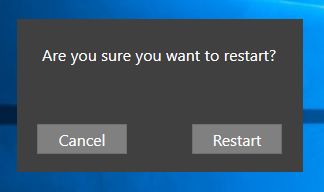

# Restart
Simple application which asks if you want to restart the computer or not. Matches theme on notifications. Clicking Restart will restart the computer.



Install this as a handler for protocol restart: so it can be used from toast notifications

```powershell
# custom protocoll handler
# https://msdn.microsoft.com/en-us/windows/desktop/aa767914
function Register-CustomUriScheme($Name, $Command) {
    If (-not (Test-Path -Path HKCR:)) {
        New-PSDrive -PSProvider registry -Root HKEY_CLASSES_ROOT -Name HKCR | Out-Null
    }

    $OldErrorActionPreference = $ErrorActionPreference
    $ErrorActionPreference = "SilentlyContinue"

    New-Item -Path "HKCR:" -ItemType Registry -Name $Name
    New-ItemProperty -Path "HKCR:\$Name" -name '(Default)' -Value "URL:$Name Protocol"  | Out-Null
    New-ItemProperty -Path "HKCR:\$Name" -name 'URL Protocol' -Value ""
    New-Item -Path "HKCR:\$Name" -ItemType Registry -Name "DefaultIcon"
    New-ItemProperty -Path "HKCR:\$Name\DefaultIcon" -name '(Default)' -Value "$Command,1"  | Out-Null
    New-Item -Path "HKCR:\$Name" -ItemType Registry -Name "shell"
    New-Item -Path "HKCR:\$Name\shell" -ItemType Registry -Name "open"
    New-Item -Path "HKCR:\$Name\shell\open" -ItemType Registry -Name "command"
    New-ItemProperty -Path "HKCR:\$Name\shell\open\command" -name '(Default)' -Value """$Command"" ""%1""" | Out-Null
    $ErrorActionPreference = $OldErrorActionPreference
}

Register-CustomUriScheme -Name "restart" -Command "$DestinationPath\Restart.exe"

```
